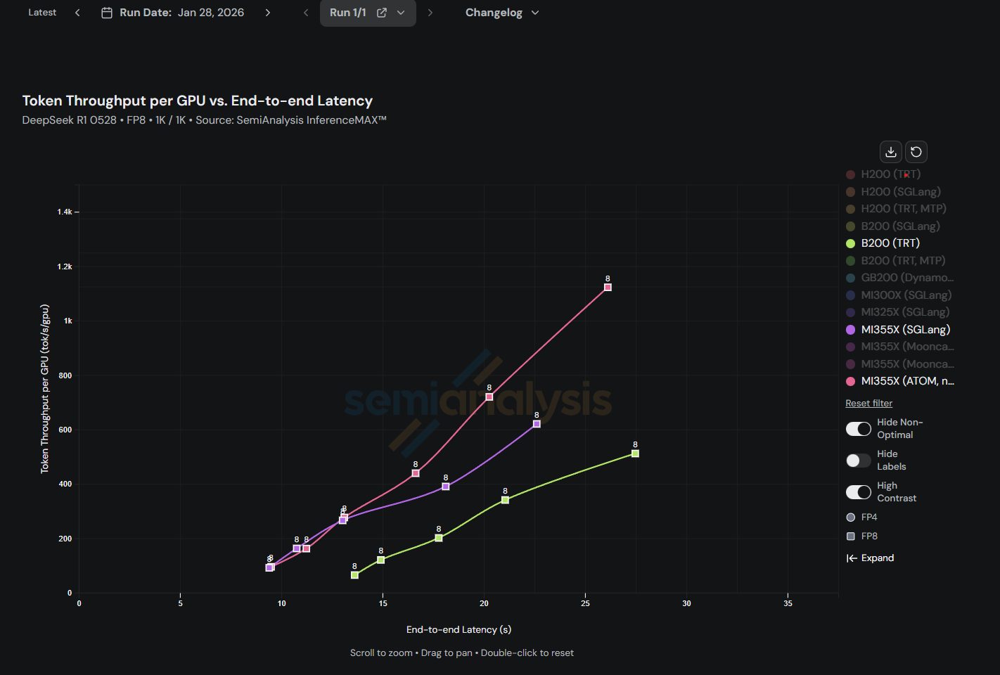

<div align="center" id="logo">
</img>
</div>

--------------------------------------------------------------------------------

**ATOM** (AiTer Optimized Model) is a lightweight vLLM-like implementation, focusing on integration and optimization based on [AITER](https://github.com/ROCm/aiter).

## 🚀 Features

- **ROCm Optimized**: Built on AMD's ROCm platform with [AITER](https://github.com/ROCm/aiter) kernels (ASM, CK, Triton)
- **OpenAI-Compatible API**: Drop-in server with `/v1/chat/completions` and `/v1/completions` endpoints
- **Piecewise torch.compile**: 4 compilation levels with CUDA graph capture for low-latency decode
- **Multi-GPU Parallelism**: Tensor parallelism (TP), data parallelism (DP), and expert parallelism (EP) with MORI all-to-all
- **Quantization**: FP8, MXFP4, INT8, INT4 with auto-detection from HuggingFace configs
- **Speculative Decoding**: Multi-Token Prediction (MTP) with EAGLE proposer
- **Prefix Caching**: xxhash64-based KV cache block sharing across sequences

### Supported Models

| Model Family | HF Architecture | Dense/MoE | Notes |
|---|---|---|---|
| [Llama](https://huggingface.co/meta-llama) | `LlamaForCausalLM` | Dense | Llama 2, Llama 3, Llama 3.1 |
| [Qwen3](https://huggingface.co/Qwen) | `Qwen3ForCausalLM` | Dense | |
| [Qwen3-MoE](https://huggingface.co/Qwen) | `Qwen3MoeForCausalLM` | MoE | 128 experts, top-8 routing |
| [DeepSeek V2/V3](https://huggingface.co/deepseek-ai) | `DeepseekV3ForCausalLM` | MoE | MLA attention, MTP speculative decoding |
| [Mixtral](https://huggingface.co/mistralai/Mixtral-8x7B-v0.1) | `MixtralForCausalLM` | MoE | 8 experts, top-2 routing |
| [GLM-4-MoE](https://huggingface.co/THUDM) | `Glm4MoeForCausalLM` | MoE | |
| [GPT-OSS](https://huggingface.co/openai) | `GptOssForCausalLM` | MoE | Sliding window + attention sinks |
| [Kimi-K2](https://huggingface.co/moonshotai/Kimi-K2-Thinking) | via `--trust-remote-code` | MoE | See [recipe](recipes/Kimi-K2-Thinking.md) |

## 📋 Requirements

- AMD GPU with ROCm support
- Docker

## 🛠️ Installation

### 1. Pull Docker Image

```bash
docker pull rocm/pytorch:rocm7.0.2_ubuntu24.04_py3.12_pytorch_release_2.8.0
```

### 2. Run Docker Container

```bash
docker run -it --network=host \
  --device=/dev/kfd \
  --device=/dev/dri \
  --group-add video \
  --cap-add=SYS_PTRACE \
  --security-opt seccomp=unconfined \
  -v $HOME:/home/$USER \
  -v /mnt:/mnt \
  -v /data:/data \
  --shm-size=16G \
  --ulimit memlock=-1 \
  --ulimit stack=67108864 \
  rocm/pytorch:rocm7.0.2_ubuntu24.04_py3.12_pytorch_release_2.8.0
```

### 3. Clone and Setup

```bash
pip install amd-aiter
git clone https://github.com/ROCm/ATOM.git; pip install ./ATOM
```

## 📚 Documentation

| **Topic** | **Description** | **Guide** |
|---|---|---|
| Architecture | System overview, request lifecycle, component design | [Architecture Guide](docs/architecture_guide.md) |
| Configuration | Config classes, CLI arguments, environment variables | [Configuration Guide](docs/configuration_guide.md) |
| Model Support | Supported models, weight loading, adding new architectures | [Model Support Guide](docs/model_support_guide.md) |
| Model Operations | AITER kernel integration, linear/attention/MoE/norm wrappers | [Model Ops Guide](docs/model_ops_guide.md) |
| Scheduling & KV Cache | Batch scheduling, block allocation, prefix caching | [Scheduling Guide](docs/scheduling_kv_cache_guide.md) |
| Compilation | torch.compile levels, CUDA graphs, piecewise compilation | [Compilation Guide](docs/compilation_cudagraph_guide.md) |
| Distributed | Tensor/data/expert parallelism, multi-GPU deployment | [Distributed Guide](docs/distributed_guide.md) |
| Serving & Benchmarks | OpenAI API server, benchmarking, profiling, speculative decoding | [Serving Guide](docs/serving_benchmarking_guide.md) |

**Deployment Recipes:**

- [Qwen3-235B-A22B](recipes/Qwen3-235b.md) -- TP8 + EP with FP8 KV cache
- [Kimi-K2-Thinking](recipes/Kimi-K2-Thinking.md) -- MXFP4 MoE on 4 GPUs

## 💡 Usage

### Basic Example

The default optimization level is 3 (piecewise torch.compile with CUDA graphs).

```bash
python -m atom.examples.simple_inference --model meta-llama/Meta-Llama-3-8B --kv_cache_dtype fp8
```

> **Note:** First-time execution may take approximately 10 minutes for model compilation.

### Serving

Start an OpenAI-compatible server:

```bash
# Single GPU
python -m atom.entrypoints.openai_server --model Qwen/Qwen3-0.6B --kv_cache_dtype fp8

# Multi-GPU with tensor parallelism
python -m atom.entrypoints.openai_server --model deepseek-ai/DeepSeek-R1 --kv_cache_dtype fp8 -tp 8
```

### Profiling

Profile offline inference:

```bash
python -m atom.examples.profile_offline --model Qwen/Qwen3-0.6B --kv_cache_dtype fp8
```

With custom input/output lengths:

```bash
python -m atom.examples.profile_offline --model Qwen/Qwen3-0.6B --kv_cache_dtype fp8 \
  --random-input --input-length 1024 --output-length 32
```

Profile a running server:

```bash
curl -s -S -X POST http://127.0.0.1:8000/start_profile
# ... run your workload ...
curl -s -S -X POST http://127.0.0.1:8000/stop_profile
```

### Benchmarking

Run an online throughput benchmark against a running server:

```bash
MODEL=deepseek-ai/DeepSeek-R1
ISL=1024
OSL=1024
CONC=128
PORT=8000
RESULT_FILENAME=Deepseek-R1-result

python -m atom.benchmarks.benchmark_serving \
  --model=$MODEL --backend=vllm --base-url=http://localhost:$PORT \
  --dataset-name=random \
  --random-input-len=$ISL --random-output-len=$OSL \
  --random-range-ratio 0.8 \
  --num-prompts=$(( $CONC * 10 )) \
  --max-concurrency=$CONC \
  --request-rate=inf --ignore-eos \
  --save-result --percentile-metrics="ttft,tpot,itl,e2el" \
  --result-dir=./ --result-filename=$RESULT_FILENAME.json
```

## 📊 Performance

### Online Serving Throughput



For more information, visit [InferenceMAX](https://inferencemax.semianalysis.com/).

### Accuracy Validation

Install `lm-eval` to test model accuracy:

```bash
pip install lm-eval[api]
```

Start a server, then run the evaluation:

```bash
python -m atom.entrypoints.openai_server --model meta-llama/Meta-Llama-3-8B --kv_cache_dtype fp8
```

```bash
lm_eval --model local-completions \
        --model_args model=meta-llama/Meta-Llama-3-8B,base_url=http://localhost:8000/v1/completions,num_concurrent=64,max_retries=3,tokenized_requests=False \
        --tasks gsm8k \
        --num_fewshot 5
```

## Acknowledgements

This project was adapted from [nano-vllm](https://github.com/GeeeekExplorer/nano-vllm).

## Support & Reporting Issues

We welcome issues and contributions! Please use the GitHub Issues page to report bugs or request features: https://github.com/ROCm/ATOM/issues
