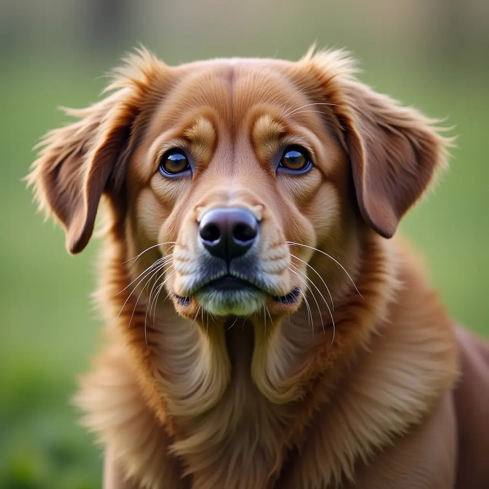

# Kimi-K2.5 with ATOM vLLM Plugin Backend

This recipe shows how to run `Kimi-K2.5` with the ATOM vLLM plugin backend. For background on the plugin backend, see [ATOM vLLM Plugin Backend](../../docs/vllm_plugin_backend_guide.md).

This model uses remote code, so the launch command keeps `--trust-remote-code`.

## Step 1: Pull the OOT Docker

```bash
docker pull rocm/atom-dev:vllm-latest
```


## Step 2: Launch vLLM Server

The ATOM vLLM plugin backend keeps the standard vLLM CLI, server APIs, and general usage flow compatible with upstream vLLM. For general server options and API usage, refer to the [official vLLM documentation](https://docs.vllm.ai/en/latest/).

```bash
vllm serve amd/Kimi-K2.5-MXFP4 \
    --host localhost \
    --port 8000 \
    --async-scheduling \
    --tensor-parallel-size 8 \
    --trust-remote-code \
    --gpu_memory_utilization 0.9 \
    --compilation-config '{"cudagraph_mode": "FULL_AND_PIECEWISE"}' \
    --kv-cache-dtype fp8 \
    --no-enable-prefix-caching
```

## Step 3: Test with simple curl
As a multimodal model, Kimi-K2.5 supports both ***text*** input and ***text + vision*** input.
### Curl with single text
```bash
curl -X POST "http://localhost:8000/v1/completions" \
     -H "Content-Type: application/json" \
     -d '{
         "prompt": "The capital of China", "temperature": 0, "top_p": 1, "top_k": 1, "repetition_penalty": 1.0, "presence_penalty": 0, "frequency_penalty": 0, "stream": false, "ignore_eos": false, "n": 1, "seed": 123
}'
```

### Curl with text + image
Let's use the image of a dog located at `ATOM/recipes/atom_vllm/dog.png` as an example.

```bash
# Convert image to base64
IMAGE_BASE64=$(base64 -w 0 ATOM/recipes/atom_vllm/dog.png)
curl -X POST "http://localhost:8000/v1/chat/completions" \
  -H "Content-Type: application/json" \
  -d '{
    "model": "amd/Kimi-K2.5-MXFP4",
    "messages": [
      {
        "role": "user",
        "content": [
          {
            "type": "text",
            "text": "What is in this image? Describe it in detail."
          },
          {
            "type": "image_url",
            "image_url": {
              "url": "data:image/png;base64,'"$IMAGE_BASE64"'"
            }
          }
        ]
      }
    ],
    "max_tokens": 256,
    "temperature": 0,
    "top_p": 1,
    "seed": 123,
    "stream": false
  }' | python3 -m json.tool
```
The expected response:
```bash
{
    "id": "chatcmpl-941a3736cc5cce95",
    "object": "chat.completion",
    "created": 1774365813,
    "model": "amd/Kimi-K2.5-MXFP4",
    "choices": [
        {
            "index": 0,
            "message": {
                "role": "assistant",
                "content": " The user wants me to describe the image in detail. Let me look at the image carefully.\n \n The image shows a young golden retriever puppy sitting on grass. The puppy has light golden/cream colored fur and appears to be looking upward and to the right with a happy expression. Its mouth is open in what looks like a smile, with its tongue visible and pink. The puppy has dark eyes and a black nose. Its ears are floppy and a slightly darker shade of golden.\n \n The puppy is sitting in a grassy area with scattered orange and yellow flowers or petals around it. The grass is green and appears well-maintained. In the background, there's a soft, blurred green backdrop (bokeh effect), which suggests a field or garden setting. The lighting is soft and natural, giving the image a warm, cheerful feeling.\n \n The puppy's posture is relaxed - it's sitting with its front legs straight and its body facing slightly to the side while its head is tilted upward. The overall mood of the image is joyful and innocent, capturing the playful and happy nature of a young puppy.\n \n Let me provide a comprehensive description covering:\n 1. The main subject (the puppy)\n 2. Physical characteristics (color, features, expression)\n 3. The",
                "refusal": null,
                "annotations": null,
                "audio": null,
                "function_call": null,
                "tool_calls": [],
                "reasoning": null
            },
            "logprobs": null,
            "finish_reason": "length",
            "stop_reason": null,
            "token_ids": null
        }
    ],
    "service_tier": null,
    "system_fingerprint": null,
    "usage": {
        "prompt_tokens": 1891,
        "total_tokens": 2147,
        "completion_tokens": 256,
        "prompt_tokens_details": null
    },
    "prompt_logprobs": null,
    "prompt_token_ids": null,
    "kv_transfer_params": null
}
```

## Step 4: Performance Benchmark
Users can use the default vllm bench command for performance benchmarking.
```bash
vllm bench serve \
    --host localhost \
    --port 8000 \
    --model amd/Kimi-K2.5-MXFP4 \
    --dataset-name random \
    --random-input-len 8000 \
    --random-output-len 1000 \
    --random-range-ratio 0.8 \
    --max-concurrency 64 \
    --num-prompts 640 \
    --trust_remote_code \
    --percentile-metrics ttft,tpot,itl,e2el
```

## Step 5: Accuracy Validation
The accuracy can be verified on gsm8k dataset with command:
```bash
lm_eval --model local-completions \
        --model_args model=amd/Kimi-K2.5-MXFP4,base_url=http://localhost:8000/v1/completions,num_concurrent=64,max_retries=3,tokenized_requests=False \
        --tasks gsm8k \
        --num_fewshot 3
```
The reference values of corresponding metrics:
```bash
local-completions ({'model': '/workspace/shared/data/models/Kimi-K2.5-MXFP4', 'base_url': 'http://localhost:8000/v1/completions', 'num_concurrent': 64, 'max_retries': 3, 'tokenized_requests': False}), gen_kwargs: ({}), limit: None, num_fewshot: 3, batch_size: 1
|Tasks|Version|     Filter     |n-shot|  Metric   |   |Value |   |Stderr|
|-----|------:|----------------|-----:|-----------|---|-----:|---|-----:|
|gsm8k|      3|flexible-extract|     3|exact_match|↑  |0.9401|±  |0.0065|
|     |       |strict-match    |     3|exact_match|↑  |0.9386|±  |0.0066|
```
