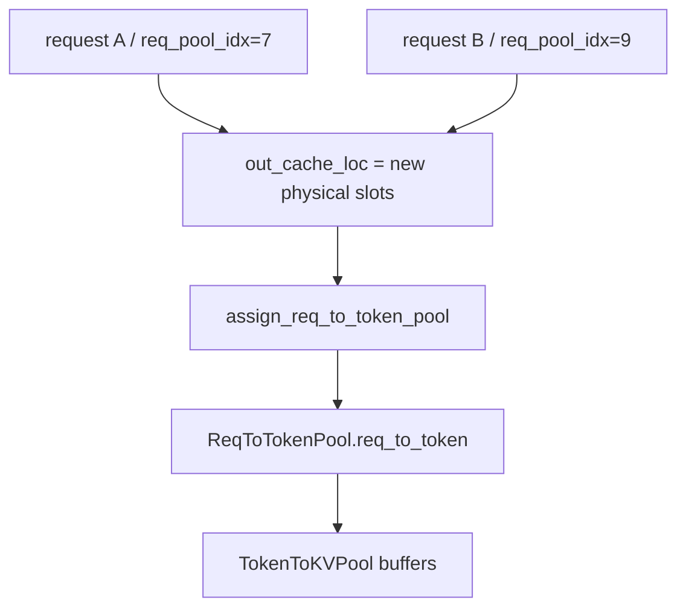
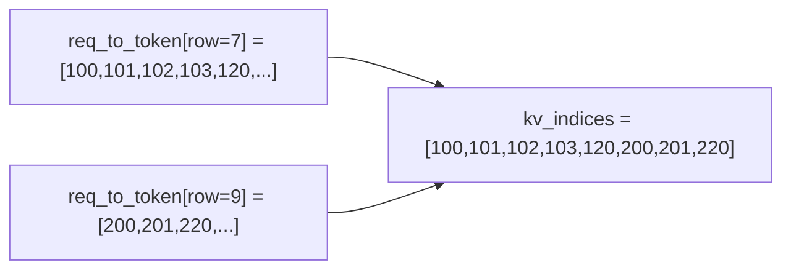

# SGLang Attention Backend 字段说明

## 文档目的

这篇文档专门解释 `ATOM/atom/plugin/sglang/attention_backend/sgl_attn_backend.py`
里 `ForwardMetadata` 的核心字段，重点放在：

- 这些字段在调度链路里是怎么来的
- 它们分别表示什么语义
- 它们的 shape 是什么
- 它们和 SGLang 的 KV cache 存储结构是什么关系

本文刻意**不展开** `reduce_indptr`、`reduce_final_map`、`reduce_partial_map`
这类更偏 kernel 内部 workspace 的字段，只在必要时顺带提一句。


## 一句话理解

可以把 `ForwardMetadata` 理解成：

- `scheduler / ForwardBatch` 已经决定了“这一步要算哪些 request、每个 request 算多少 query、这些 query 应该看到哪些 KV”
- `attn_backend.init_forward_metadata()` 负责把这个高层语义，转换成 attention kernel 真正能消费的低层索引

其中最关键的就是三类信息：

- **Q 侧分段信息**：`qo_indptr`, `max_q_len`
- **KV 侧分段信息**：`kv_indptr`, `kv_indices`, `kv_last_page_len`, `max_kv_len`
- **非 MLA 下的 page 化信息**：`page_table`, `kv_lens`


## 1. 三层 batch 抽象

SGLang 里和 attention metadata 直接相关的 batch 抽象有三层：

- `ScheduleBatch`
- `ModelWorkerBatch`
- `ForwardBatch`

其中：

- `ScheduleBatch`
  - scheduler 视角
  - 关心请求、prefix、seq len、cache slot 分配
- `ModelWorkerBatch`
  - worker 视角
  - 是一次 GPU forward 所需字段的中间态
- `ForwardBatch`
  - attention backend / kernel 视角
  - 大部分字段已经是 GPU tensor

可以粗略画成：


`ForwardMetadata` 就是 `ForwardBatch` 再往下走一步，把“批次语义”翻译成“索引语义”的结果。


## 2. 调度到 metadata 的主链路

最值得记住的链路是：

1. scheduler 决定这一步 batch 里有哪些 request
2. scheduler 为这些 request 分配或复用 KV slot
3. `ScheduleBatch.get_model_worker_batch()` 把调度状态打包
4. `ForwardBatch.init_new()` 把 CPU 侧 list / 状态变成 GPU tensor
5. `attn_backend.init_forward_metadata()` 生成 `ForwardMetadata`

对应几个关键字段来源如下：

- `req_pool_indices`
  - 来自 `ScheduleBatch`
  - 表示每个 request 在 `ReqToTokenPool.req_to_token` 里的“行号”
- `seq_lens`
  - 每个 request 当前参与 attention 的 KV 长度
- `out_cache_loc`
  - 本轮新 token 写入 KV cache 的物理 slot
- `extend_seq_lens`
  - prefill / extend 时，每个 request 本轮真正新增了多少 query token
- `spec_info`
  - speculative 路径下额外提供 verify / draft_extend 需要的 query 结构


## 3. 先看 KV cache 的两层存储

理解 `kv_indptr` / `kv_indices` 之前，必须先看清 SGLang 的 KV cache 存储不是“一块连续上下文”，而是两层映射：

- `ReqToTokenPool`
- `TokenToKVPool`

### 3.1 `ReqToTokenPool`

文件：

- `sglang/python/sglang/srt/mem_cache/memory_pool.py`

核心张量：

- `req_to_token`

shape：

- `[req_pool_size, max_context_len]`
- dtype 通常是 `int32`

语义：

- 行：一个 request slot
- 列：这个 request 的逻辑 token 位置
- 值：该位置对应的 **物理 KV slot id**

也就是说，`req_to_token` 不是存 K/V 本身，而是存：

- `request 的第 i 个 token，实际写到了 token_to_kv_pool 的哪个 slot`

可以理解成：

```text
req_to_token[req_pool_idx, token_pos] = physical_kv_slot
```

### 3.2 `TokenToKVPool`

它是真正存物理 K/V 的地方。

根据注意力形式不同，常见有两类：

- `MHATokenToKVPool`
- `MLATokenToKVPool`

### 3.3 MHA KV cache 形状

文件：

- `sglang/python/sglang/srt/mem_cache/memory_pool.py`

MHA 下，每层通常有两块 buffer：

- `k_buffer[layer]`
- `v_buffer[layer]`

shape：

- `k_buffer[layer]`: `[(size + page_size), num_kv_heads, head_dim]`
- `v_buffer[layer]`: `[(size + page_size), num_kv_heads, v_head_dim]`

这里的第一维就是 **物理 token slot**。

也就是说：

- `loc = 12345`
- `k_buffer[layer][12345]`
- `v_buffer[layer][12345]`

就是这个 token 在该层的物理 KV 存储位置。

额外的 `+ page_size` 是为了预留 padding / dummy 写入空间。源码里有一句很关键：

- padded slot 0 用于 padded token 的 dummy output write

所以它不是严格只分配 `size` 个可见 token 位置，而是多留了一点缓冲。

### 3.4 MLA KV cache 形状

MLA 下不是单独一块 K、一块 V，而是一个合并后的 latent KV buffer。

shape：

- `kv_buffer[layer]`: `[(size + page_size), 1, kv_cache_dim]`

其中：

- `kv_cache_dim = kv_lora_rank + qk_rope_head_dim`
  - 对 DeepSeek MLA，通常就是 latent KV 部分加 rope 部分

这意味着：

- MHA：一个 slot 对应 `K` 和 `V`
- MLA：一个 slot 对应一个融合后的 latent cache 向量

对 DeepSeek MLA，常见理解方式是：

- 前半段：`kv_a` / latent KV
- 后半段：`k_pe` / rope 部分


## 4. `req_to_token` 和 `out_cache_loc` 的关系

调度器在每轮 forward 前，会先给新 token 分配物理 slot，得到：

- `out_cache_loc`

shape：

- `[num_new_tokens]`

语义：

- 本轮所有新增 token 应该写到哪些物理 KV slot

然后再把这些 slot 填回 `req_to_token` 的对应位置。

可以画成：



本质上：

- `out_cache_loc` 决定“新 token 写哪里”
- `req_to_token` 记录“逻辑位置到物理 slot 的长期映射”


## 5. `ForwardMetadata` 核心字段总览

下面重点解释这些字段：

- `kv_indptr`
- `kv_indices`
- `qo_indptr`
- `kv_last_page_len`
- `max_q_len`
- `max_kv_len`
- `page_table`
- `kv_lens`

### 5.1 一个总表

| 字段 | 常见 shape | 主要用于 | 一句话语义 |
|------|------------|----------|------------|
| `kv_indptr` | `[bs + 1]` | MLA | KV flatten 后每个 request 的段边界 |
| `kv_indices` | `[sum(kv_lens)]` | MLA | flatten 后每个 KV token 对应的物理 slot |
| `qo_indptr` | `[bs + 1]` | MLA / speculative | Q flatten 后每个 request 的段边界 |
| `kv_last_page_len` | `[bs]` | MLA paged kernel | 每个 request 最后一个 page 里有多少有效 token |
| `max_q_len` | `int` | 所有 attention kernel | batch 内单个 request 的最大 query 长度 |
| `max_kv_len` | `int` or `None` | extend / prefill | batch 内单个 request 的最大 KV 长度 |
| `page_table` | `[bs, max_pages]` | 非 MLA | request -> page id 的二维表 |
| `kv_lens` | `[bs]` | 非 MLA | 每个 request 的 KV 长度 |


## 6. `kv_indptr` 是什么

### 6.1 语义

`kv_indptr` 是一个 CSR 风格的前缀和数组。

shape：

- `[bs + 1]`

语义：

- 第 `i` 个 request 的 KV 段，在 `kv_indices` 中的范围是：
  - `[kv_indptr[i], kv_indptr[i + 1])`

所以它不是“KV 长度本身”，而是：

- `flatten 之后每段的起止边界`

### 6.2 它通常怎么构造

典型构造方式：

```text
kv_indptr[0] = 0
kv_indptr[1:] = cumsum(kv_lens)
```

其中：

- decode 下，`kv_lens` 往往就是 `seq_lens`
- target_verify 下，MLA 常是 `seq_lens + draft_token_num`
- draft_extend 下，可能来自 speculative 专门生成的 prefill 参数

### 6.3 例子

假设 batch 里有两个 request：

- request A 的 KV 长度 = 5
- request B 的 KV 长度 = 3

那么：

```text
kv_lens   = [5, 3]
kv_indptr = [0, 5, 8]
```

表示：

- request A 对应 `kv_indices[0:5]`
- request B 对应 `kv_indices[5:8]`


## 7. `kv_indices` 是什么

### 7.1 语义

`kv_indices` 是一个 flatten 后的一维数组。

shape：

- `[sum(kv_lens)]`

语义：

- 它的每个元素都是 **物理 KV slot id**
- 这些 slot id 来自 `req_to_token`

换句话说：

- `kv_indices` 是“这一步 attention 真正要访问哪些物理 KV token”

### 7.2 它和 `req_to_token` 的关系

`create_flashinfer_kv_indices_triton(...)` 会根据：

- `req_pool_indices`
- `req_to_token`
- `kv_lens`
- `kv_indptr`

把每个 request 对应的那一段 `req_to_token[row, :kv_len]`
抽出来，拼成一个一维的 `kv_indices`。

### 7.3 例子

假设：

- `req_pool_indices = [7, 9]`
- `req_to_token[7, 0:5] = [100, 101, 102, 103, 120]`
- `req_to_token[9, 0:3] = [200, 201, 220]`

那么：

```text
kv_indptr  = [0, 5, 8]
kv_indices = [100, 101, 102, 103, 120, 200, 201, 220]
```

这就表示：

- request A 的 attention 访问物理 slot `100,101,102,103,120`
- request B 的 attention 访问物理 slot `200,201,220`

可以把它理解为：




## 8. `qo_indptr` 是什么

### 8.1 语义

`qo_indptr` 和 `kv_indptr` 是对称的，但它描述的是 **Q / output 侧**。

shape：

- `[bs + 1]`

语义：

- 第 `i` 个 request 的 query 段，在 flatten 后的 Q 张量中的范围是：
  - `[qo_indptr[i], qo_indptr[i + 1])`

### 8.2 为什么它很重要

attention backend 经常把 batch 里的 query token flatten 成一个二维/三维张量去跑 kernel。

这时 kernel 需要知道：

- 哪些 query 属于 request A
- 哪些 query 属于 request B

`qo_indptr` 就是这份分段说明书。

### 8.3 不同模式下的典型含义

- decode
  - 每个 request 只有 1 个 query
  - 所以常见是 `[0, 1, 2, ..., bs]`
- 普通 extend / prefill
  - 每个 request 的 query 数就是 `extend_seq_lens[i]`
  - 所以通常是 `cumsum(extend_seq_lens)`
- target_verify
  - 每个 request 通常有 `draft_token_num` 个 query
  - 所以常是 `[0, d, 2d, 3d, ...]`
- draft_extend
  - 每个 request 的 query 数可能不同
  - 常来自 `accept_length` 或 `extend_seq_lens`

### 8.4 例子

假设有两个 request：

- request A 本轮新增 query = 3
- request B 本轮新增 query = 2

那么：

```text
extend_seq_lens = [3, 2]
qo_indptr       = [0, 3, 5]
```

表示：

- request A 的 query 是 flatten Q 中的 `[0:3]`
- request B 的 query 是 flatten Q 中的 `[3:5]`


## 9. `kv_last_page_len` 是什么

### 9.1 语义

这是分页 KV cache 下很重要的一个辅助量。

shape：

- `[bs]`

语义：

- 每个 request 的最后一个 page 里，有多少个有效 token

因为 paged KV cache 不是要求每个 request 的长度都刚好是 `page_size` 的整数倍，所以最后一个 page 往往只有一部分有效。

### 9.2 例子

假设 `page_size = 4`：

- request A 的 KV 长度 = 5
- request B 的 KV 长度 = 3

那么：

- request A 有 2 个 page，最后一个 page 有 1 个有效 token
- request B 有 1 个 page，最后一个 page 有 3 个有效 token

对应：

```text
kv_last_page_len = [1, 3]
```


## 10. `max_q_len` 和 `max_kv_len`

### 10.1 `max_q_len`

语义：

- batch 内单个 request 的最大 query 长度

常见来源：

- decode: `1`
- 普通 extend: `max(extend_seq_lens)`
- target_verify: `draft_token_num`
- draft_extend: 常是 `max(extend_seq_lens)` 或 `max(accept_length)`

shape：

- Python `int`

作用：

- kernel 需要知道 batch 内最大 query 段长度，来决定 tile / workspace / pad 方式

### 10.2 `max_kv_len`

语义：

- batch 内单个 request 的最大 KV 长度

常见来源：

- 普通 extend / prefill：`max(seq_lens)`
- 某些 decode / verify MLA 路径里可能不单独存，或者设成 `None`

shape：

- Python `int` 或 `None`


## 11. `page_table` 和 `kv_lens`

这两个字段更偏 **非 MLA** 路径，是 `kv_indptr/kv_indices` 的 page 化替代表示。

### 11.1 `page_table`

shape：

- `[bs, max_num_pages_per_request]`

语义：

- 每一行对应一个 request
- 每个元素是一个 physical page id

它不是 token-level 的 flatten 索引，而是 page-level 的二维映射。

### 11.2 `kv_lens`

shape：

- `[bs]`

语义：

- 每个 request 当前 KV 长度

kernel 会结合：

- `page_table`
- `kv_lens`
- `page_size`

来知道每个 request 该读哪些 page、最后一页有多少有效 token。

### 11.3 这组字段是不是只给 MLA 用

不是。

`ForwardMetadata` 更准确地说是一个：

- **统一容器**

它里面同时装了：

- MLA 常用的 metadata
- MHA 常用的 metadata
- 两边都可能用到的通用字段

可以粗略分成三类：

| 类别 | 字段 |
|------|------|
| 更偏 MLA | `kv_indptr`, `kv_indices`, `qo_indptr`, `kv_last_page_len` |
| 更偏 MHA | `page_table`, `kv_lens`, `pa_metadata_*` |
| 通用 | `max_q_len`, `max_kv_len` |

也就是说：

- **不是只有 MLA 才会创建 `ForwardMetadata`**
- 而是 **MLA 和 MHA 共用这个 dataclass**
- 只是不同 kernel 最终只消费其中的一部分字段

### 11.4 MHA 的 metadata 代码在哪里

如果想看 `sgl_attn_backend.py` 里 **MHA 真正的 metadata 路径**，主要看这几段：

- `_init_decode_mha()`
- `_init_extend_mha()`
- `_build_pa_metadata_for_decode()`
- `_build_pa_metadata_for_prefill()`

含义可以概括成：

- `decode`
  - 优先看 `page_table`, `kv_lens`
  - 如果走 `pa_persistent_fwd`，再看 `pa_metadata_*`
- `extend / prefill`
  - 主要看 `max_q_len`, `max_kv_len`
  - page 化路径下也会继续依赖 `page_table`, `kv_lens`

换句话说：

- **MLA 更像 “token-level flattened 索引驱动”**
- **MHA 更像 “page-table / context-len 驱动”**

### 11.5 为什么 MHA 通常不需要 `kv_last_page_len`

这个问题最容易和 MLA 搞混。

核心原因是：

- MHA 在这个 backend 里通常走的是：
  - `page_table + kv_lens`
  - 或者 `pa_metadata_*`
- MLA 则更依赖：
  - `kv_indptr + kv_indices + kv_last_page_len`

对 MHA 来说，kernel 经常直接拿到：

- 每个 request 的 `context_lens`
- 每个 request 对应哪些 page（`page_table`）
- 固定的 `page_size`

于是：

- 最后一页有多少有效 token
- 可以由 `context_lens % page_size`
- 或更高层 page metadata 直接推出来

所以 MHA 不一定需要把：

- “最后一个 page 的有效长度”

单独存成 `kv_last_page_len`。

而 MLA 的 paged kernel 实现更偏 token-flatten / ragged 索引驱动，显式传：

- `kv_last_page_len`

会更直接、更方便。

### 11.6 为什么 MHA 通常不需要 `qo_indptr`

`qo_indptr` 的本质是：

- flatten 后 query 段的边界表

它在 MLA 里很重要，因为 MLA kernel 经常直接消费：

- ragged / flatten 的 Q 段
- 对应的 KV flatten 段

而 MHA 在这个 plugin 里常见有两类路径：

#### 路径一：decode 的 `pa_fwd_asm` / `pa_persistent_fwd`

这类 kernel 更偏：

- `block_tables = page_table`
- `context_lens = kv_lens`

decode 下每个 request 本来就只有 1 个 query，所以 query 分段是隐含的：

- batch 第 0 个 query 属于 request 0
- batch 第 1 个 query 属于 request 1

这时单独维护 `qo_indptr` 不是必须的。

#### 路径二：extend 的 `flash_attn_varlen_func`

这条路在当前 plugin 里更依赖：

- 显式传入的 `q`, `k`, `v`
- `max_q_len`, `max_kv_len`
- 以及运行时构出来的 `cu_seqlens_q`

这里 query 的分段信息已经由：

- 输入张量本身
- `cu_seqlens_q`

表达出来了，所以 `qo_indptr` 也不是核心字段。

因此可以把它理解成：

- **MLA 喜欢把 Q 段边界显式放进 metadata**
- **MHA 更常把 Q 段边界隐含在输入张量和专用 kernel 参数里**

### 11.7 为什么 MHA 通常不需要 `kv_indptr + kv_indices`

`kv_indptr + kv_indices` 的组合，本质上是在表达：

- “把所有 request 的 KV token 拉平成一条长数组之后，每个 request 的 KV 段从哪里开始，到哪里结束”

这是一种非常适合：

- ragged token-level attention
- MLA flatten KV 访问

的表示法。

但 MHA 在 paged cache 下经常不需要把 KV 先 flatten 成 token 列表。

因为它可以直接用：

- `page_table`
- `kv_lens`

来表达同一件事：

- 第 `i` 个 request 对应哪些 page
- 这些 page 中实际有多少 token 是有效的

可以类比为：

- `kv_indptr + kv_indices`
  - 是 token-level 的“稀疏展开形式”
- `page_table + kv_lens`
  - 是 page-level 的“块索引形式”

两者本质都在回答：

- “本轮 attention 应该读哪些 KV”

只是表达层次不同。

所以不是说 MHA **完全不能** 用 `kv_indptr + kv_indices`，
而是：

- 在当前 backend 的主实现里，MHA 的更自然表示是 `page_table + kv_lens`
- `kv_indptr + kv_indices` 在 MHA 路径里通常不是主角

### 11.8 一个简化对照表

| 场景 | 更核心的 metadata |
|------|-------------------|
| MLA decode | `kv_indptr`, `kv_indices`, `qo_indptr`, `kv_last_page_len` |
| MLA extend | `kv_indptr`, `kv_indices`, `qo_indptr`, `max_q_len`, `max_kv_len` |
| MHA decode | `page_table`, `kv_lens`, `pa_metadata_*` |
| MHA extend | `max_q_len`, `max_kv_len`，以及必要时的 `page_table`, `kv_lens` |


## 12. 三个最重要的例子

### 12.1 例子一：普通 decode

假设：

- `bs = 2`
- `seq_lens = [5, 3]`
- `req_pool_indices = [7, 9]`
- `page_size = 4`

并且：

- `req_to_token[7, 0:5] = [100, 101, 102, 103, 120]`
- `req_to_token[9, 0:3] = [200, 201, 220]`

那么：

```text
kv_indptr       = [0, 5, 8]
kv_indices      = [100, 101, 102, 103, 120, 200, 201, 220]
qo_indptr       = [0, 1, 2]
kv_last_page_len= [1, 3]
max_q_len       = 1
```

含义：

- 每个 request 只解一个 token
- query 一共 2 个
- 但每个 query 需要看到自己已有的完整上下文 KV

### 12.2 例子二：普通 extend / prefill

假设：

- request A：prefix 长度 5，本轮 extend 3 个 token，总长 8
- request B：prefix 长度 7，本轮 extend 2 个 token，总长 9

则：

```text
extend_prefix_lens = [5, 7]
extend_seq_lens    = [3, 2]
seq_lens           = [8, 9]
qo_indptr          = [0, 3, 5]
max_q_len          = 3
max_kv_len         = 9
```

理解方式：

- Q 侧看的是“本轮新增的 3/2 个 token”
- KV 侧看的是“整个请求当前总长度 8/9”

也就是说：

- `qo_indptr` 由本轮新增 query 决定
- `kv_indptr / max_kv_len` 由总上下文长度决定

### 12.3 例子三：`TARGET_VERIFY`

假设：

- `bs = 2`
- `seq_lens = [5, 3]`
- `draft_token_num = 4`

那么对每个 request：

- 本轮要验证 4 个 draft token
- 但每个 query 能看到的 KV 长度不是原始 `seq_lens`
- 而是 `seq_lens + draft_token_num`

于是：

```text
qo_indptr  = [0, 4, 8]
kv_lens    = [9, 7]
kv_indptr  = [0, 9, 16]
max_q_len  = 4
```

这个例子非常重要，因为它说明：

- verify 不是普通 decode
- 也不是普通 extend
- 它会同时改变 Q 的分段和 KV 的可见长度

这也是为什么 speculative path 不能简单复用普通 extend metadata。


## 13. 一个完整的“逻辑位置 -> 物理 KV”例子

假设 request A 当前已经有 5 个 token：

```text
req_pool_idx = 7
req_to_token[7, 0:5] = [100, 101, 102, 103, 120]
```

这表示：

- 逻辑 token 0 -> physical slot 100
- 逻辑 token 1 -> physical slot 101
- 逻辑 token 2 -> physical slot 102
- 逻辑 token 3 -> physical slot 103
- 逻辑 token 4 -> physical slot 120

如果本轮又新分配了两个 slot：

```text
out_cache_loc = [130, 131]
```

并把它们写回 request A 的逻辑位置 5、6：

```text
req_to_token[7, 5] = 130
req_to_token[7, 6] = 131
```

那么 request A 的完整逻辑到物理映射就变成：

```text
[100, 101, 102, 103, 120, 130, 131]
```

之后 attention metadata 只要知道：

- `req_pool_idx = 7`
- `kv_len = 7`

就能通过 `req_to_token` 自动构造出：

```text
kv_indices = [100, 101, 102, 103, 120, 130, 131]
```


## 14. 可以如何快速判断一个字段该不该看

如果你在 debug `sgl_attn_backend.py`，可以用下面这个经验法则：

- 想知道“这轮每个 request 有多少 query”
  - 看 `qo_indptr`, `max_q_len`, `extend_seq_lens`
- 想知道“这轮每个 request 的 KV 能看到多长”
  - 看 `kv_indptr`, `kv_last_page_len`, `max_kv_len`, `kv_lens`
- 想知道“这些 KV 实际在 cache 里是哪几个 slot”
  - 看 `kv_indices`
- 想知道“request 的逻辑 token 位置和物理 slot 怎么对应”
  - 看 `req_to_token_pool.req_to_token`
- 想知道“本轮新 token 会写去哪里”
  - 看 `out_cache_loc`


## 15. 最后总结

如果只记三句话：

1. `req_to_token` 是 **逻辑 token 位置 -> 物理 KV slot** 的长期映射表。
2. `kv_indptr + kv_indices` 是把这张长期映射表裁成“本轮 attention 真正要访问的 KV 列表”。
3. `qo_indptr` 是 query 侧的分段表，告诉 kernel flatten 后哪些 query 属于哪个 request。

所以：

- `scheduler` 决定 batch 语义
- `req_to_token / out_cache_loc` 决定 cache 物理布局
- `ForwardMetadata` 把二者翻译成 kernel 真正能消费的索引

这就是 `sgl_attn_backend.py` 里这些字段的核心意义。
