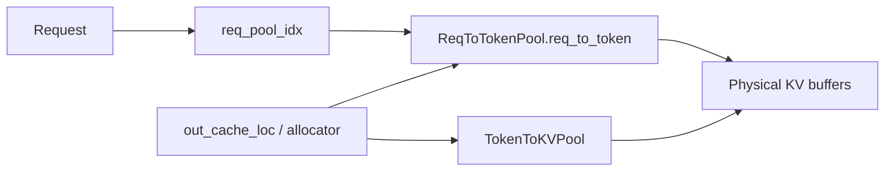
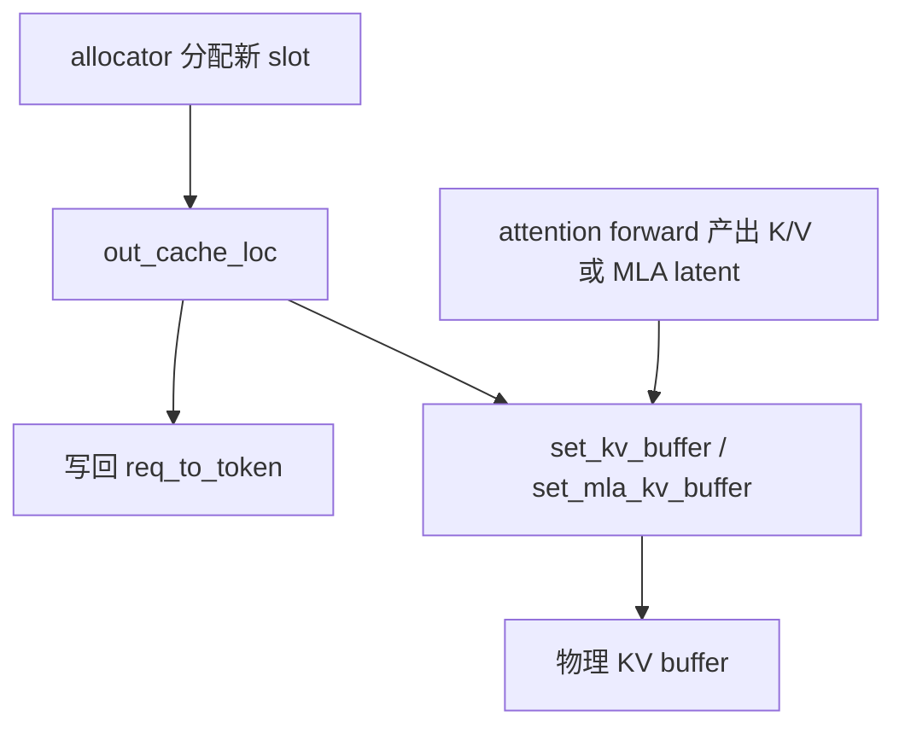

# SGLang KV Cache Storage Guide

## 文档目的

这篇文档专门解释：

- SGLang 里 KV cache 是怎么存的
- MHA 和 MLA 的存储结构有什么区别
- `ReqToTokenPool`、allocator、`TokenToKVPool` 分别负责什么
- 常见张量 shape 是什么
- 逻辑 token 是怎么映射到物理 KV slot 的

本文聚焦 **SGLang 本身的 KV cache 存储**，不展开 vLLM 或 ATOM native 的实现差异。


## 一句话理解

SGLang 的 KV cache 不是“每个 request 一块连续显存”。

它更像一个两级系统：

1. `ReqToTokenPool`
   - 维护逻辑映射
   - 回答“这个 request 的第 t 个 token 存在哪个 slot”
2. `TokenToKVPool`
   - 维护物理存储
   - 真正把 K/V 或 MLA latent 写进 GPU buffer

可以先记住这个核心公式：

```text
req_to_token[req_pool_idx, token_pos] = physical_slot
```


## 1. 先统一几个概念

### 1.1 request slot

SGLang 不直接拿 request id 当数组下标。

它会先从 `ReqToTokenPool` 给每个活跃 request 分一个：

- `req_pool_idx`

这就是这个 request 在 `req_to_token` 表里的“行号”。

### 1.2 token slot

一个 token slot 表示：

- 某一层 KV cache 里，一个 token 对应的一行物理存储位置

它通常是一个全局整数，例如：

- `100`
- `101`
- `2025`

### 1.3 page

当 `page_size > 1` 时，slot 会按 page 分组。

可以理解成：

```text
一个 page = page_size 个连续 token slot
```

于是：

```text
slot = page_id * page_size + page_offset
```

### 1.4 `out_cache_loc`

`out_cache_loc` 是本轮新分配出来的物理 slot 列表。

shape：

- extend / prefill：`[extend_num_tokens]`
- decode：通常是 `[bs * token_per_req]`

它表示：

- 本轮新 token 应该写到 KV cache 的哪些物理位置


## 2. 总体架构

可以把 SGLang 的 KV cache 存储看成三层：

- request 级逻辑层
- token/page 分配层
- 物理存储层



更具体一点：

- `ReqToTokenPool`
  - 存“逻辑 token 位置 -> 物理 slot”
- allocator
  - 决定这一步还能分到哪些新 slot
- `TokenToKVPool`
  - 存每层真实的 K/V 或 MLA latent


## 3. 第一层：`ReqToTokenPool`

文件：

- `sglang/python/sglang/srt/mem_cache/memory_pool.py`

核心类：

- `ReqToTokenPool`

核心张量：

- `req_to_token`

shape：

- `[req_pool_size, max_context_len]`

dtype：

- `int32`

语义：

- 第 0 维：request slot，也就是 `req_pool_idx`
- 第 1 维：该 request 的逻辑 token 位置
- 元素值：这个逻辑 token 对应的物理 KV slot

也就是：

```text
req_to_token[req_pool_idx, token_pos] = physical_slot
```

### 3.1 例子

假设 request A 被分到：

- `req_pool_idx = 7`

并且当前已经有 5 个 token：

```text
req_to_token[7, 0:5] = [100, 101, 102, 103, 120]
```

那么它的逻辑到物理映射就是：

- token 0 -> slot 100
- token 1 -> slot 101
- token 2 -> slot 102
- token 3 -> slot 103
- token 4 -> slot 120

注意：

- 这里的 slot 不要求连续
- 因为分页分配、复用、evict 都可能让物理位置不连续


## 4. 第二层：allocator

allocator 负责：

- 从可用的 KV 空间中分配新的 slot 或 page
- 返回 `out_cache_loc`
- 再把结果写回 `req_to_token`

SGLang 里常见有两类 allocator：

- `TokenToKVPoolAllocator`
  - `page_size = 1`
  - 更像 token 粒度的平铺分配
- `PagedTokenToKVPoolAllocator`
  - `page_size > 1`
  - 更像 page 粒度分配

相关文件：

- `sglang/python/sglang/srt/mem_cache/allocator.py`
- `sglang/python/sglang/srt/mem_cache/common.py`

### 4.1 `page_size = 1`

这时 allocator 的视角非常简单：

- 一个 free slot 就是一个 free token position

分配出来的 `out_cache_loc` 可以直接看成：

- 一串 token slot id

源码里还有一个关键细节：

- slot `0` 被保留给 padded token / dummy write

所以真正可分配的 slot 常从 `1` 开始。

### 4.2 `page_size > 1`

这时 allocator 虽然内部按 page 管理，
但对上层仍然返回：

- token-level 的 `out_cache_loc`

也就是说，上层最终看到的还是：

- 这一步每个新 token 具体写到哪个 slot

只是这些 slot 是由 page allocator 算出来的。

### 4.3 extend 时 allocator 做了什么

`alloc_for_extend()` 的语义可以概括成：

1. 先给 request 分配 `req_pool_idx`
2. 再根据 prefix 长度和目标 seq 长度，分配这一步新增 token 的物理 slot
3. 生成 `out_cache_loc`
4. 把这些新 slot 写回 `req_to_token`

所以：

- `out_cache_loc` 是“这一步新 token 的写入位置”
- `req_to_token` 是“整个 request 的长期索引表”

### 4.4 decode 时 allocator 做了什么

decode 最常见是每个 request 增加 1 个 token。

这时：

- allocator 为每个 request 分 1 个新 slot
- `out_cache_loc` 的长度通常就是 batch size
- 然后把这个新 slot 写到 `req_to_token[req_pool_idx, 当前 seq_len]`


## 5. 第三层：物理 KV 存储

这层才是真正的大显存 buffer。

SGLang 里和 attention 相关的主要有：

- `MHATokenToKVPool`
- `MLATokenToKVPool`

两者最大的区别在于：

- MHA 存 K 和 V 两份 buffer
- MLA 存一份 packed latent buffer


## 6. MHA 的 KV cache 存储

文件：

- `sglang/python/sglang/srt/mem_cache/memory_pool.py`

核心类：

- `MHATokenToKVPool`

### 6.1 核心 buffer

每层有两份物理 buffer：

- `k_buffer[layer]`
- `v_buffer[layer]`

shape：

- `k_buffer[layer]`: `[(size + page_size), num_kv_heads, head_dim]`
- `v_buffer[layer]`: `[(size + page_size), num_kv_heads, v_head_dim]`

这里：

- 第 0 维是物理 slot
- 第 1 维是 KV heads
- 第 2 维是每个 head 的维度

`size + page_size` 的原因是：

- 除了正常容量，还预留了 padding / dummy 写入空间

### 6.2 怎么写入

写入接口通常是：

- `set_kv_buffer(layer, loc, cache_k, cache_v, ...)`

其中：

- `loc.shape = [num_tokens]`
- `cache_k.shape = [num_tokens, num_kv_heads, head_dim]`
- `cache_v.shape = [num_tokens, num_kv_heads, v_head_dim]`

语义就是：

```text
k_buffer[layer][loc[i]] = cache_k[i]
v_buffer[layer][loc[i]] = cache_v[i]
```

### 6.3 怎么读

读取接口通常是：

- `get_key_buffer(layer_id)`
- `get_value_buffer(layer_id)`
- `get_kv_buffer(layer_id)`

attention backend 会根据 `req_to_token` 算出的 slot，
去这些 buffer 里 gather 对应位置。


## 7. MLA 的 KV cache 存储

文件：

- `sglang/python/sglang/srt/mem_cache/memory_pool.py`

核心类：

- `MLATokenToKVPool`

### 7.1 核心 buffer

MLA 下，每层通常只有一份主 buffer：

- `kv_buffer[layer]`

shape：

- `[(size + page_size), 1, kv_cache_dim]`

其中：

```text
kv_cache_dim = kv_lora_rank + qk_rope_head_dim
```

这表示：

- 每个物理 slot 存的是一段 packed latent KV
- 不是标准 MHA 意义上的分离 K / V

### 7.2 逻辑拆分

对于 DeepSeek MLA，通常可以把这段 packed buffer 理解成：

- 前半段：`kv_a` / latent KV
- 后半段：`k_pe` / rope 相关部分

也就是说，一个 slot 里实际上装的是：

```text
[cache_k_nope | cache_k_rope]
```

### 7.3 写入接口

MLA 常见有两种写法：

- `set_kv_buffer(...)`
  - 直接把 packed cache 写进去
- `set_mla_kv_buffer(layer, loc, cache_k_nope, cache_k_rope)`
  - 分别传 latent 部分和 rope 部分，由底层 helper 拼到一起

典型输入 shape：

- `loc`: `[num_tokens]`
- `cache_k_nope`: `[num_tokens, 1, kv_lora_rank]`
- `cache_k_rope`: `[num_tokens, 1, qk_rope_head_dim]`

### 7.4 读取接口

MLA 也有专门的读取接口：

- `get_mla_kv_buffer(layer, loc, dst_dtype)`

返回：

- `cache_k_nope`: `[num_tokens, 1, kv_lora_rank]`
- `cache_k_rope`: `[num_tokens, 1, qk_rope_head_dim]`

所以 MLA 的“读出来再用”其实也是把 packed storage 再拆回两部分。


## 8. MHA 和 MLA shape 对照表

| 项目 | MHA | MLA |
|------|-----|-----|
| 主 buffer 数量 | 2 份：K / V | 1 份：packed latent |
| 每层物理 shape | K:`[slots, Hkv, Dk]` V:`[slots, Hkv, Dv]` | `[slots, 1, kv_lora_rank + qk_rope_head_dim]` |
| 第 0 维含义 | 物理 token slot | 物理 token slot |
| 典型写入接口 | `set_kv_buffer()` | `set_mla_kv_buffer()` |
| 典型读取接口 | `get_kv_buffer()` | `get_mla_kv_buffer()` |
| 逻辑视角 | 标准 K/V cache | latent KV + rope 部分 |


## 9. `out_cache_loc`、`req_to_token`、buffer 的关系

可以把一次写入过程画成：



这里有两个并行动作：

- `out_cache_loc` 被写回 `req_to_token`
- 同时新算出来的 KV 被写进物理 buffer

这样下一轮只要知道：

- `req_pool_idx`
- 当前 `seq_len`

就能通过 `req_to_token` 找到历史 token 对应的所有物理 slot。


## 10. 例子一：非分页 MHA decode

假设：

- `page_size = 1`
- batch 有 2 个 request
- `req_pool_indices = [7, 9]`
- 当前 `seq_lens = [5, 3]`

已有映射：

```text
req_to_token[7, 0:5] = [100, 101, 102, 103, 120]
req_to_token[9, 0:3] = [200, 201, 220]
```

本轮 decode，每个 request 新增 1 个 token，allocator 返回：

```text
out_cache_loc = [130, 221]
```

然后写回：

```text
req_to_token[7, 5] = 130
req_to_token[9, 3] = 221
```

于是下一轮：

- request A 的完整上下文 slot 是 `[100,101,102,103,120,130]`
- request B 的完整上下文 slot 是 `[200,201,220,221]`

物理存储上则是：

```text
k_buffer[layer][130] = new_k_for_A
v_buffer[layer][130] = new_v_for_A

k_buffer[layer][221] = new_k_for_B
v_buffer[layer][221] = new_v_for_B
```


## 11. 例子二：分页 MHA extend

假设：

- `page_size = 4`
- request A 的 prefix 长度 = 5
- 本轮 extend 后总长度 = 8

也就是：

- prefix token 已经占了 5 个逻辑位置
- 本轮要再写 3 个 token

假设它当前最后一个已用 slot 是：

```text
last_loc = 120
```

而这个 `120` 恰好在某个 page 的中间。

那么 allocator 在 `alloc_paged_token_slots_extend()` 里大概会做两件事：

1. 先尽量把当前未满的最后一个 page 填满
2. 如果还不够，再分配新 page

可能得到：

```text
out_cache_loc = [121, 122, 200]
```

这表示：

- 前两个 token 继续写进原 page 的剩余位置
- 第三个 token 写进新 page 的第一个 slot

然后写回：

```text
req_to_token[7, 5:8] = [121, 122, 200]
```

所以分页 allocator 的重点不是“返回 page id”，而是：

- **最终依然返回 token-level slot ids**


## 12. 例子三：MLA 写入和读取

假设：

- `kv_lora_rank = 512`
- `qk_rope_head_dim = 64`

那么：

```text
kv_cache_dim = 576
```

对某层来说，MLA 物理 buffer 的 shape 可能是：

```text
kv_buffer[layer].shape = [num_slots, 1, 576]
```

本轮有 2 个新 token：

```text
loc = [130, 131]
cache_k_nope.shape = [2, 1, 512]
cache_k_rope.shape = [2, 1, 64]
```

调用：

```text
set_mla_kv_buffer(layer, loc, cache_k_nope, cache_k_rope)
```

后，可以理解为：

```text
kv_buffer[layer][130] = concat(cache_k_nope[0], cache_k_rope[0])
kv_buffer[layer][131] = concat(cache_k_nope[1], cache_k_rope[1])
```

后续 attention 需要读取历史 cache 时，再通过：

```text
get_mla_kv_buffer(layer, loc=[100,101,130], dst_dtype=bf16)
```

拿回：

- `cache_k_nope`: `[3, 1, 512]`
- `cache_k_rope`: `[3, 1, 64]`


## 13. 为什么 SGLang 要搞两层，而不是直接 request -> kv buffer

因为推理服务不是静态 batch。

SGLang 的 request 会不断：

- 加入
- 完成
- 被截断
- 被 speculative verify / draft_extend 修改
- 被分页 allocator 扩容

如果直接给每个 request 一块连续大 buffer：

- 复用差
- 容易碎片化
- prefix cache / page cache 不好做

两层结构的好处是：

- `ReqToTokenPool`
  - 负责逻辑组织
- `TokenToKVPool`
  - 负责物理存储

这样：

- request 的逻辑顺序可以变
- 物理 slot 可以复用
- page allocator 可以独立演化
- MHA / MLA 只需要换底层 KV pool 的 shape，不用重写上层 request 索引系统


## 14. 和 attention metadata 的关系

KV cache 存储本身只回答：

- 数据放在哪里

attention metadata 还要回答：

- 本轮到底读哪些 token
- 这些 token 该怎么分段
- 对应哪个 request

所以常见链路是：

1. `req_to_token`
   - 保存 request 的长期逻辑到物理映射
2. `out_cache_loc`
   - 保存本轮新 token 的新物理位置
3. attention metadata
   - 从 `req_to_token` 中抽出本轮真正要访问的那部分 slot
   - 形成 `kv_indices` 或 `page_table`

也就是说：

- KV cache storage 是“数据库”
- attention metadata 是“查询结果”


## 15. 调试时最该先看什么

如果你在 debug SGLang KV cache，建议按这个顺序看：

1. `req_pool_idx`
   - 这个 request 映射到哪一行
2. `req_to_token[row, :seq_len]`
   - 当前逻辑 token 对应哪些物理 slot
3. `out_cache_loc`
   - 本轮新 token 写到哪里
4. `k_buffer / v_buffer` 或 `kv_buffer`
   - 这些 slot 位置上实际存了什么 shape
5. attention metadata
   - 例如 `kv_indices` / `page_table`
   - 看本轮真正读的是不是你以为的那些 slot


## 16. 最后总结

如果只记 6 句话：

1. `ReqToTokenPool.req_to_token` 是 SGLang KV cache 的逻辑索引总表。
2. `out_cache_loc` 是本轮新 token 的物理写入位置。
3. allocator 可能按 token 或 page 分配，但返回给上层的通常仍是 token-level slot。
4. MHA 物理存储是两份：
   - `k_buffer[layer]: [slots, Hkv, Dk]`
   - `v_buffer[layer]: [slots, Hkv, Dv]`
5. MLA 物理存储是一份 packed buffer：
   - `kv_buffer[layer]: [slots, 1, kv_lora_rank + qk_rope_head_dim]`
6. attention metadata 不是重复存储 KV cache，而是基于 `req_to_token` 再生成“本轮实际访问哪些 KV”的索引视图。

这就是 SGLang 里 KV cache 存储的核心结构。
