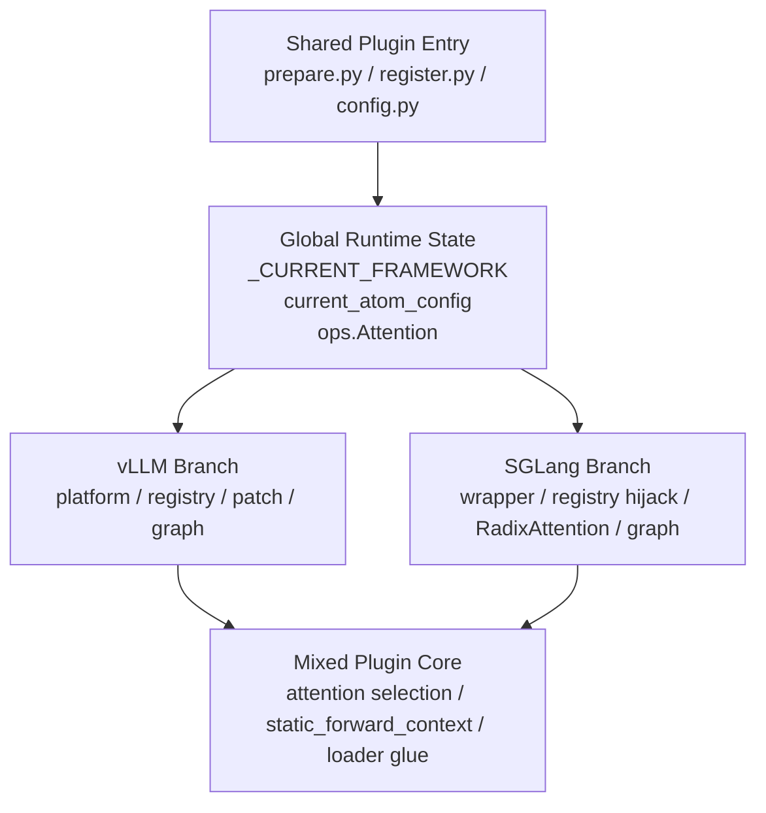
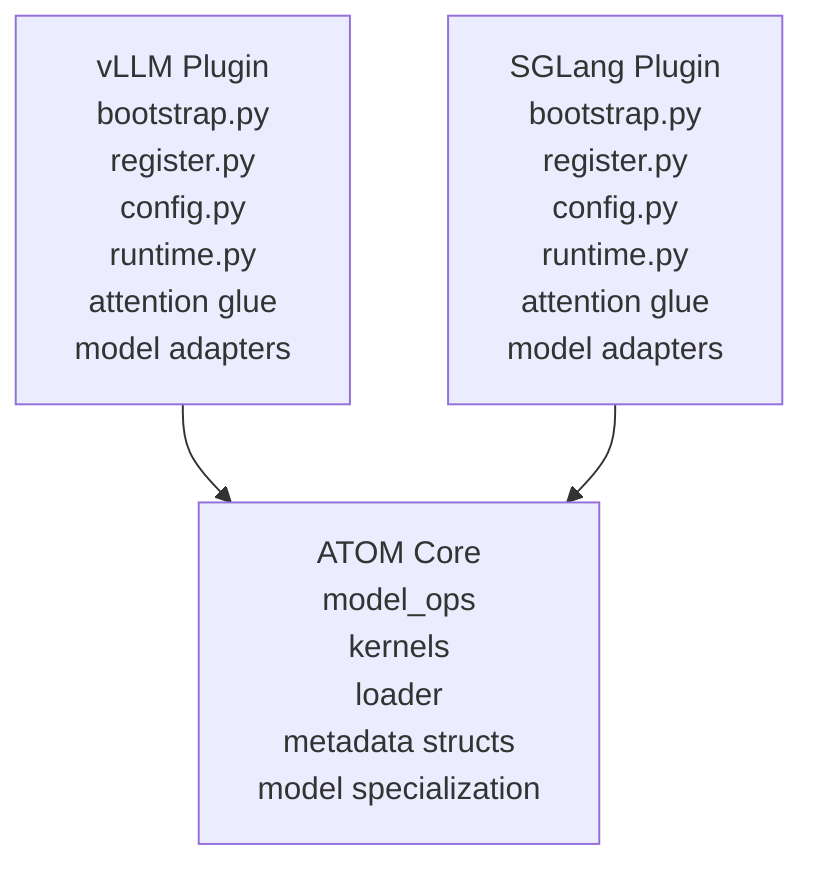
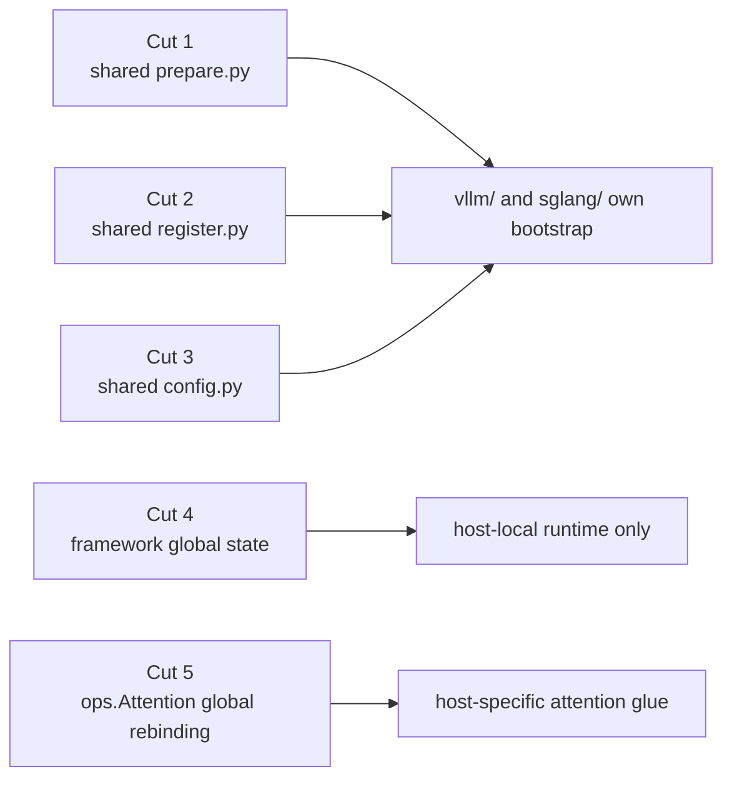

# ATOM Plugin Decoupling Diagram

下面这张图对比了当前入口架构和目标解耦架构。这里采用的是更激进、也更干净的方案：

- `vLLM plugin` 和 `SGLang plugin` 在 `atom/plugin/` 层彻底分家
- 不再保留共享的 plugin runtime
- 共享只发生在更底层的 `ATOM core`

## Current



### 当前设计的核心问题

- 入口层通过切换全局状态来区分 `vLLM` 和 `SGLang`，而不是通过物理隔离的子系统建立边界。
- `prepare.py` / `register.py` / `config.py` 这些共享入口，本身就是耦合中心。
- host 差异直接泄漏到 plugin 内部结构里，导致 backend 选择、attention 抽象和 runtime context 都知道上层框架。

## Target



### 目标设计的关键点

- `vLLM` 和 `SGLang` 在 plugin 层是两个完整子系统，而不是一套共享 runtime 上的两个分支。
- `atom/plugin/` 下不再存在共享的 `prepare_model()`、共享的 `register.py` 总入口、共享的 plugin config translator。
- `vLLM plugin` 自己处理：
  - platform registration
  - model override
  - graph / MLA / weight hook patch
  - vLLM model adapter / attention glue
- `SGLang plugin` 自己处理：
  - external model wrapper
  - attention backend registration / override
  - graph / speculative / wrapper patch
  - SGLang model adapter / attention glue
- 真正共享的只保留在更底层的 `ATOM core`：
  - `model_ops`
  - kernels
  - loader
  - generic metadata structures
  - model-family specialization

## 最重要的切断点



## 推荐目录形态

```text
atom/plugin/
  vllm/
    bootstrap.py
    register.py
    config.py
    runtime.py
    attention/
    models/
    graph/
  sglang/
    bootstrap.py
    register.py
    config.py
    runtime.py
    attention/
    models/
    graph/
```

这里的重点不是“换目录”，而是：

- `vllm/runtime.py` 和 `sglang/runtime.py` 各自独立
- `vllm/config.py` 和 `sglang/config.py` 各自独立
- `vllm/register.py` 和 `sglang/register.py` 各自独立
- 不再有 plugin 级共享 runtime

## 术语说明

### bootstrap

`bootstrap` 在这里指的是“插件被宿主框架加载时，最先执行的接线初始化层”。

它负责的事情通常包括：

- 注册 plugin 扩展点
- 安装 patch / hook
- 构造 host adapter / wrapper
- 把宿主配置翻译到 ATOM 可用的格式

它不应该负责：

- attention forward 本身
- 长期 runtime state 管理
- 每次请求都要走的核心执行逻辑

### register

`register` 指的是把 plugin 的能力挂到宿主暴露的扩展点上，例如：

- 注册 platform
- 注册 model class
- 注册 attention backend

它更偏“声明接入点”，通常是 bootstrap 的一部分。

### adapter

`adapter` 指的是宿主框架和 ATOM core 之间的桥接层。  
它的职责是做接口和参数语义翻译，而不是定义 attention / model 的核心语义。

### runtime

`runtime` 指的是插件在宿主里长期存在、服务执行链路的那部分运行时逻辑。  
如果按这份设计推进，`runtime` 应该是 host-local 的：

- `vLLM runtime` 只属于 `vLLM plugin`
- `SGLang runtime` 只属于 `SGLang plugin`

而不是共享一个“Plugin runtime”。

## 一句话结论

真正的解耦不是把共享入口再包装一层，而是把 `atom/plugin` 从“共享状态机”改成“两个完全独立的 host plugin 子系统”，共享只留给更底层的 `ATOM core`。
