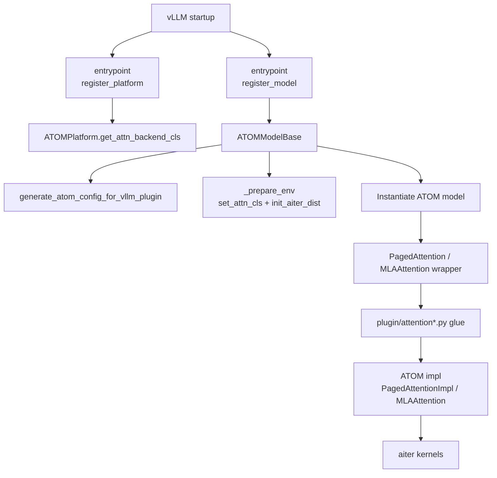

# ATOM vLLM Plugin Integration Architecture

## 1. 启动入口

vLLM plugin 的 setuptools entrypoint 定义在：

- `pyproject.toml`

关键位置：

- `vllm.platform_plugins`
  - `atom = "atom.plugin.vllm.register:register_platform"`
- `vllm.general_plugins`
  - `atom_model_registry = "atom.plugin.vllm.register:register_model"`

这意味着 vLLM 启动时会先进入：

- `atom/plugin/vllm/register.py::register_platform()`
- `atom/plugin/vllm/register.py::register_model()`

## 2. 关键代码文件与职责

### 2.1 `atom/plugin/vllm/register.py`

这是 vLLM plugin 的启动接线层，主要负责：

- 设置 plugin mode
- 返回自定义 platform
- 覆盖 vLLM 的 `ModelRegistry`
- 安装 MLA patch
- patch `Attention.process_weights_after_loading`
- 安装 graph capture patch

重点符号：

- `register_platform()`
- `register_model()`
- `_VLLM_MODEL_REGISTRY_OVERRIDES`

## 2.2 `atom/plugin/vllm/platform.py`

这是 vLLM 平台侧 attention backend 选择入口。

重点符号：

- `ATOMPlatform.get_attn_backend_cls()`

它根据 `attn_selector_config` 决定：

- MHA -> `atom.model_ops.attentions.aiter_attention.AiterBackend`
- MLA -> `atom.model_ops.attentions.aiter_mla.AiterMLABackend`
- sparse MLA -> `atom.plugin.vllm.attention_backend.mla_sparse.AiterMLASparseBackend`

这里是 vLLM runtime 真正选择 “哪个 ATOM attention backend class” 的入口。

## 2.3 `atom/plugin/vllm/model_wrapper.py`

这是 vLLM model integration 的核心文件。

主要职责：

- 把 `VllmConfig` 翻译成 `atom_config`
- 做 plugin 运行环境准备
- 选择并实例化 ATOM 模型类
- 把 vLLM forward context 中的 `positions` 传给 ATOM 路径
- 对 sparse MLA indexer 做额外注册

重点符号：

- `_prepare_env()`
- `ATOMModelBase.__init__()`
- `_register_indexer_caches_with_vllm()`
- `forward()`

## 2.4 `atom/plugin/config.py`

这是 vLLM 配置翻译的桥。

重点符号：

- `generate_atom_config_for_vllm_plugin()`
- `_generate_atom_config_from_vllm_config()`

它负责把：

- `VllmConfig`
- `scheduler_config`
- `cache_config`
- `parallel_config`
- `quant_config`

映射成 ATOM 自己的 `Config` 与 `PluginConfig`。

## 2.5 `atom/model_ops/paged_attention.py`

这是 ATOM attention 在 vLLM plugin 下真正进入执行的关键对象。

重点符号：

- `PagedAttention.__init__()`
- `PagedAttention.forward()`

在 `is_vllm()` 下，它不会直接走 native/server 的那套 `impl` 初始化，而是：

- 构造 vLLM 的 `Attention` / `MLAAttention` 外壳
- 把额外 impl 参数塞进去
- 注册到 `static_forward_context`
- forward 时通过 `unified_attention_with_output_base_for_plugin_mode()` 回调到 ATOM impl

## 2.6 `atom/plugin/attention.py`

这是 vLLM plugin mode 的核心 glue 层。

虽然文件在 `plugin/` 根目录，但从职责看它明显偏 vLLM。

主要职责：

- 定义 `vllmAiterAttentionBackendMethods`
- 提供 backend decorator / metadata builder decorator
- 处理 plugin-mode metadata
- 处理 `static_forward_context`
- 为 vLLM 的 attention backend 补 OOT 接口行为

重点符号：

- `vllmAiterAttentionBackendMethods`
- 各类 `*DecoratorForPluginMode`

## 2.7 `atom/plugin/attention_mha.py`

这是 vLLM plugin mode 下 MHA impl 的补丁层。

重点符号：

- `PagedAttentionImplPluginModeMethods`

它补的是：

- rope/cache/update
- plugin-mode forward
- 与 vLLM KV cache/metadata 对齐的逻辑

## 2.8 `atom/plugin/attention_mla.py`

这是 vLLM plugin mode 下 MLA impl 的补丁层。

重点符号：

- `MLAAttentionImplPluginModeMethods`
- `_mla_plugin_mode_init`

它补的是：

- MLA plugin-mode metadata
- qk rope / kv cache / chunked prefill
- vLLM MLA 路径专有行为

## 2.9 `atom/plugin/vllm/mla_patch.py`

这是 vLLM 原生 `MLAAttention` 的 monkey patch 入口。

重点符号：

- `_patch_vllm_mla_attention_forward_impl()`
- `_patch_vllm_mla_attention_process_weights_after_loading()`
- `patch_vllm_mla_attention()`

这层作用是：

- 把 vLLM `MLAAttention.forward_impl()` 改接到 ATOM impl
- 把权重后处理改接到 ATOM 的 `impl.process_weights_after_loading()`

## 2.10 `atom/plugin/vllm/graph_capture_patch.py`

这是 vLLM graph capture 补丁入口。

重点符号：

- `apply_graph_capture_patch()`

它实际委托到共享实现：

- `atom/plugin/graph_capture_patch.py`

但调用点是 vLLM 自己的 plugin register 流程。

## 3. 当前 vLLM plugin 集成链路

## 4. 最关键的架构判断

### 4.1 vLLM plugin 不是简单“替换 backend class”

它实际上同时做了三件事：

1. 替换 vLLM 的 model entry
2. 替换/选择 vLLM 的 attention backend class
3. 用 patch + decorator 的方式把 vLLM 的 layer/runtime 语义桥接到 ATOM impl

### 4.2 真正共享得最好的是 native/server 与 vLLM plugin 的 attention impl

尤其：

- `PagedAttentionImpl`
- `MLAAttention`
- 低层 `aiter` kernel family

也就是说，vLLM plugin 侧的关键复杂度主要不在 kernel，而在：

- `ModelRegistry` override
- `VllmConfig -> atom_config`
- `static_forward_context`
- `MLAAttention` patch
- graph capture patch

### 4.3 当前 `plugin/attention.py`、`attention_mha.py`、`attention_mla.py`

虽然放在 `atom/plugin/` 根目录，但从 vLLM integration 的角度看，它们本质上更像：

- `vLLM plugin impl glue`
- 而不是真正框架无关的 shared runtime

## 5. 推荐你重点阅读的文件顺序

如果你是为了快速理解 vLLM plugin 集成架构，建议按这个顺序读：

1. `pyproject.toml`
2. `atom/plugin/vllm/register.py`
3. `atom/plugin/vllm/platform.py`
4. `atom/plugin/vllm/model_wrapper.py`
5. `atom/plugin/config.py`
6. `atom/model_ops/paged_attention.py`
7. `atom/plugin/vllm/mla_patch.py`
8. `atom/plugin/attention.py`
9. `atom/plugin/attention_mha.py`
10. `atom/plugin/attention_mla.py`

## 6. 一句话结论

vLLM plugin 的集成方式，本质上是：

**用 entrypoint + platform + model wrapper 接入 vLLM，用 ATOM 自己的 attention impl 和 aiter kernels 提供核心执行，再用 patch/decorator 把 vLLM 的 layer/runtime 语义桥接进去。**
